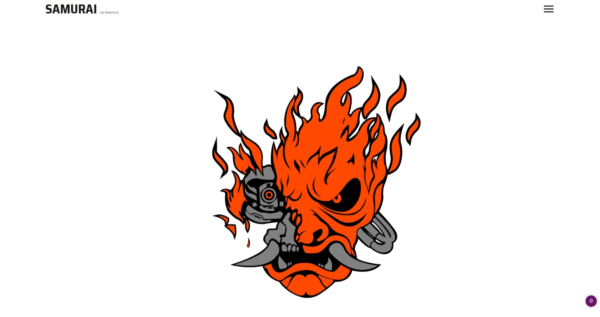
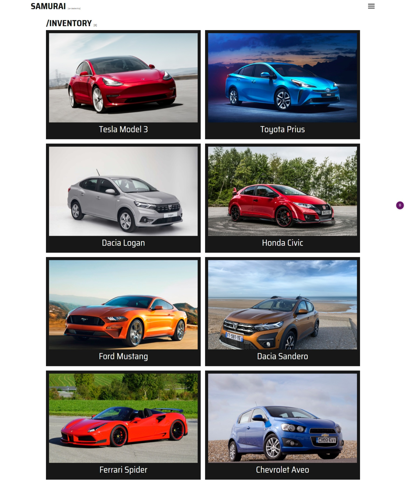
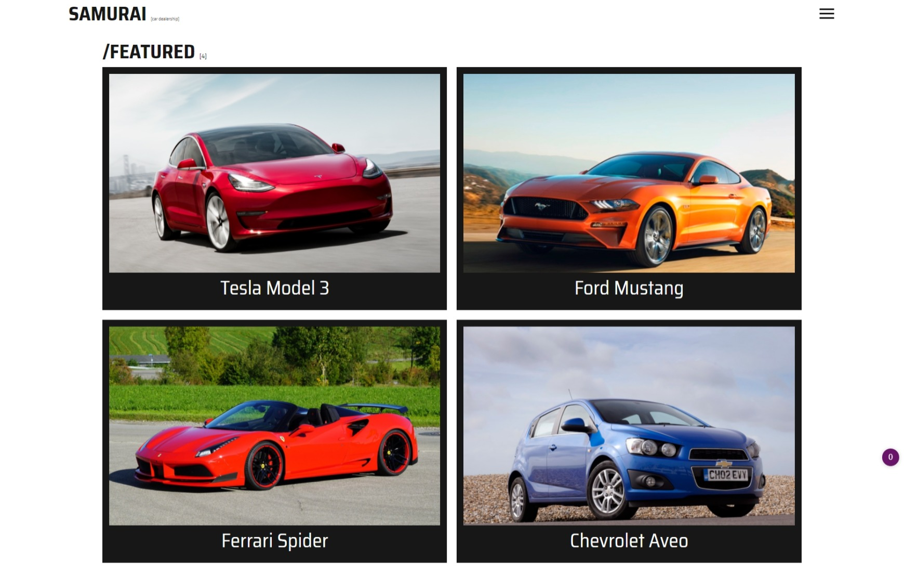
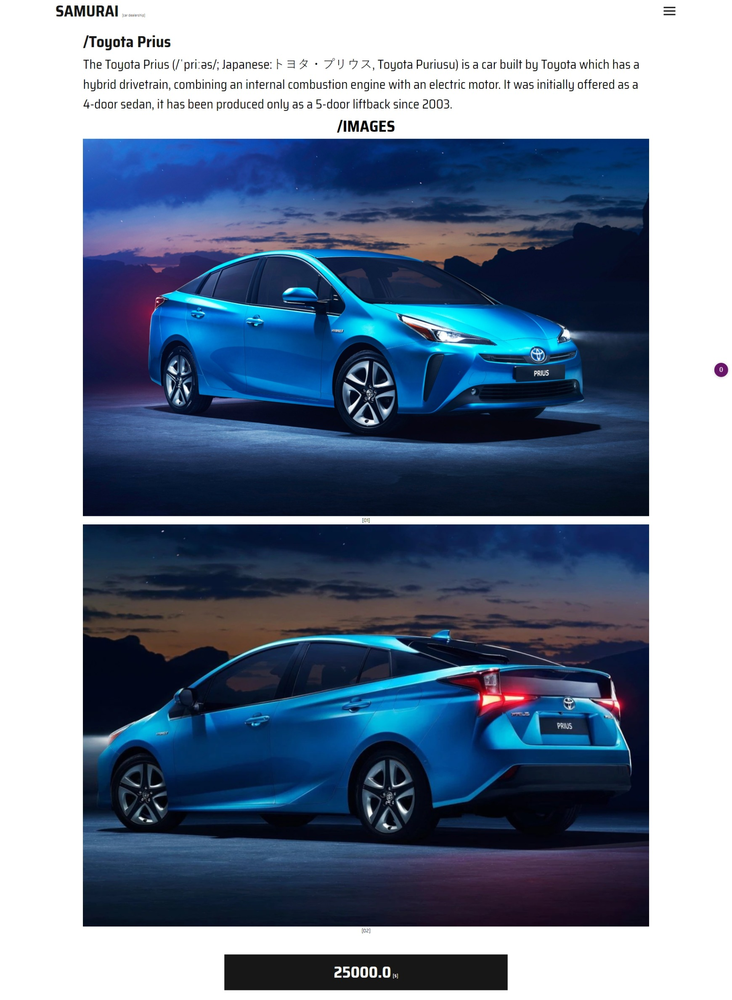
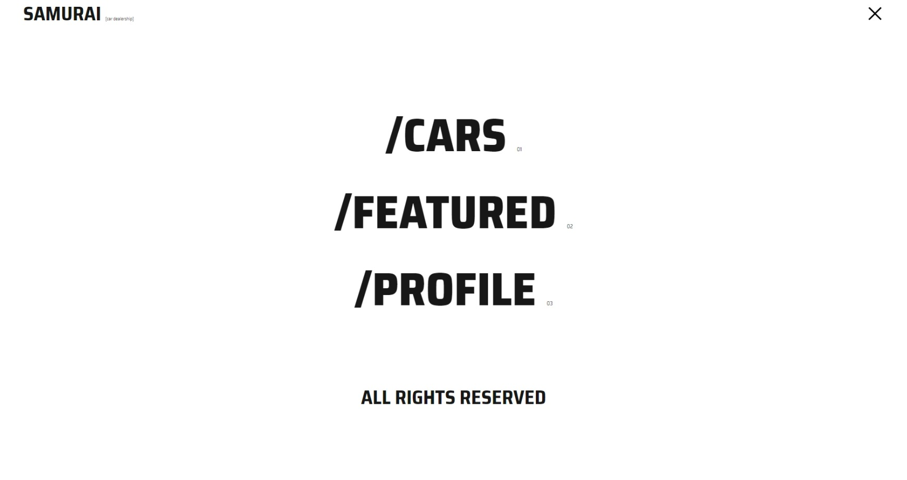
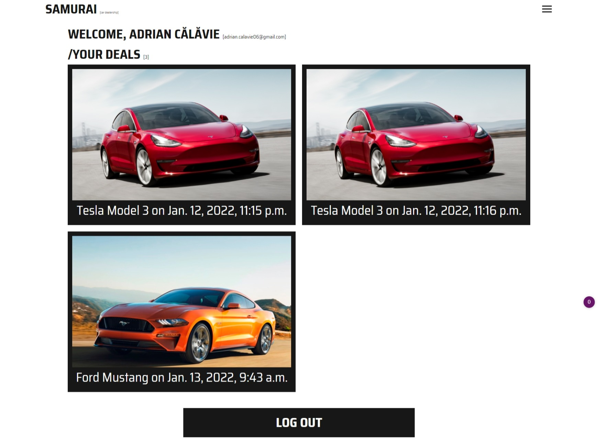

# SAMURAI

This is a car dealership app made in Django.
## Tech Stack
* Python(Django) 🐍
* allauth 🔑
* sqlite3 💾
* JS/CSS/HTML 🦋

## How to run

* Create a python env
* Activate the env
* Install requirements.txt
* Install [allauth](https://django-allauth.readthedocs.io/en/latest/installation.html)
* Run `python manage.py makemigrations`
* Run `python manage.py migrate --run-syncdb`
* Run `python manage.py runserver`
* That's it, if something goes wrong, feel free to contact me 👽

# Screens

